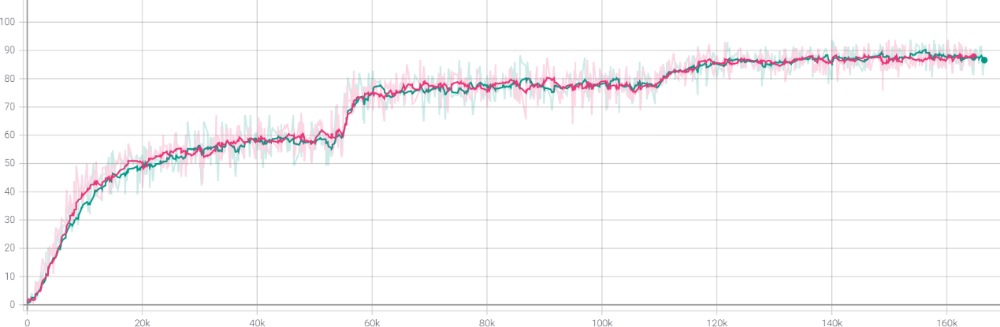
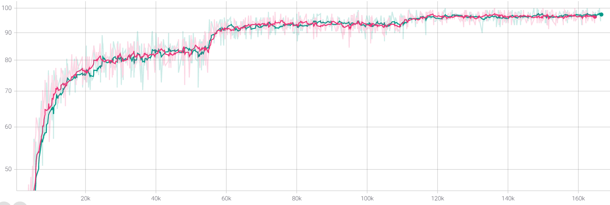
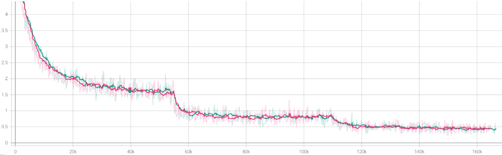
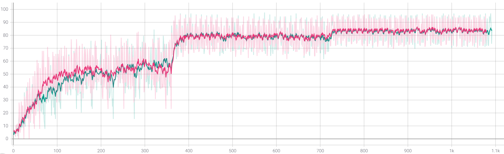
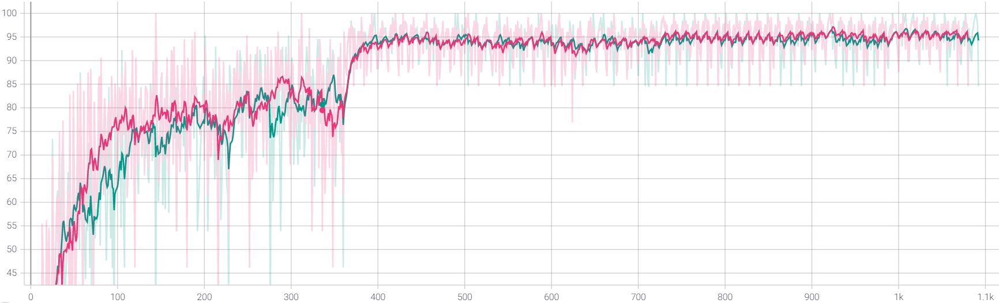
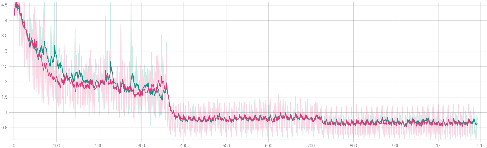

# mixed_precision_pytorch

author: pprp

date: 2021-1-1

## 项目目的

本项目主要是为了复现ResNet50在ImageNet上的结果，并且测试混合精度训练对模型的影响，分析其对训练速度、训练准确率等指标的影响。

## 项目介绍

数据来源：

http://www.image-net.org/download-images

主要有两个版本：

- project_lightning: 使用了Pytorch Lightning框架，实现了训练ImageNet。
- project_pytorch: 使用了原生PyTorch配合apex进行ImageNet的训练。
- requirements.txt列举了环境的依赖。
- run_official.sh是训练时运行的脚本。

数据集、log文件都没有包括在库中。

硬件：

- CPU：Intel Core I9-10900K @ 3.70GHz 

- 显卡：GeForce RTX 2080Ti(11G) x 4 

- 内存：64G 

软件： 

- 系统：Window 10 
- CUDA 11.0+CuDNN 8.0 
- PyTorch 1.6.0、Apex、PyTorch Lightning 
- 容器：Anaconda 
- IDE：Vscode

## 实验结果

训练过程top1 acc: 

训练过程top5 acc: 

训练过程中loss:

验证集上top1 acc:

验证集上top5 acc:

验证集loss曲线：

| 指标                 | 混合精度 | FP32训练 |
| -------------------- | -------- | -------- |
| Top1 Accuracy(train) | 79.19%   | 78.94%   |
| Top2 Accuracy(train) | 92.78%   | 92.62%   |
| Top1 Accuracy(val)   | 75.63%   | 75.46%   |
| Top2 Accuracy(val)   | 92.68%   | 92.61%   |
| Time-consuming       | 2day     | 2day12h  |

## 参考文献

[1] He, Kaiming, Zhang, Xiangyu, Ren, Shaoqing and Sun, Jian Deep Residual Learning for Image Recognition. (2015). , cite arxiv:1512.03385Comment: Tech report .

[2] Micikevicius, P.; Narang, S.; Alben, J.; Diamos, G.; Elsen, E.; Garcia, D.; Ginsburg, B.; Houston, M.; Kuchaiev, O.; Venkatesh, G. & Wu, H. (2017), 'Mixed Precision Training' , cite arxiv:1710.03740Comment: Published as a conference paper at ICLR 2018 .

[3] He, T.; Zhang, Z.; Zhang, H.; Zhang, Z.; Xie, J. & Li, M. (2018), 'Bag of Tricks for Image Classification with Convolutional Neural
 Networks', .

 